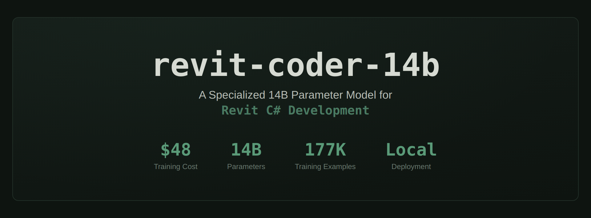
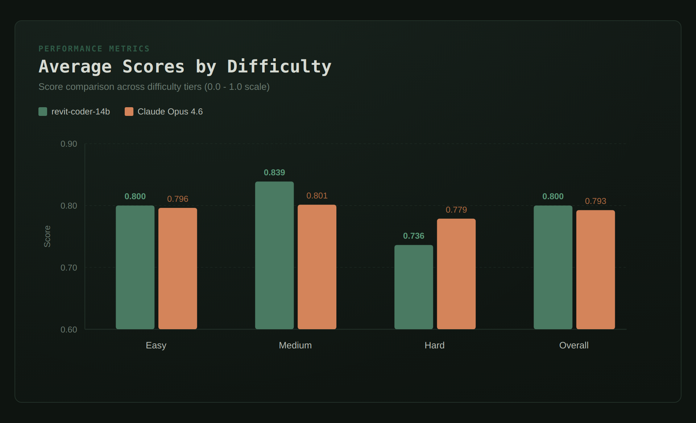
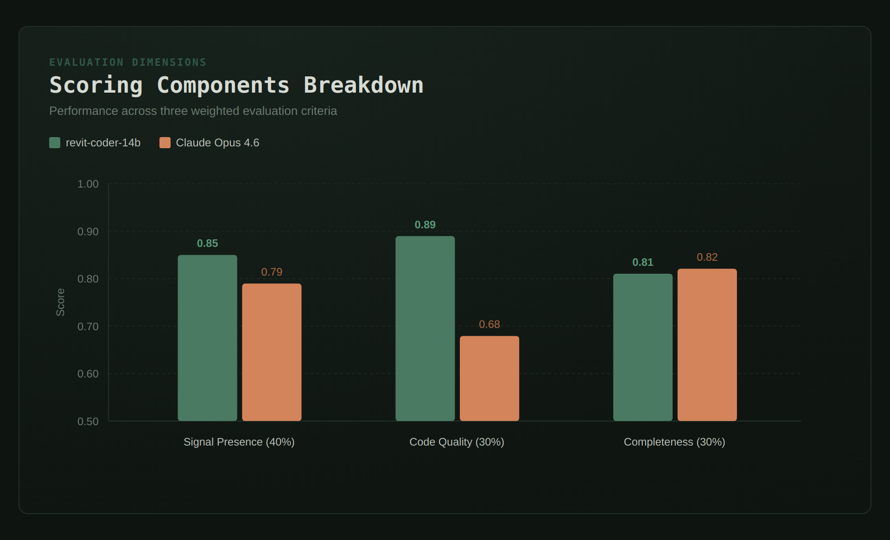
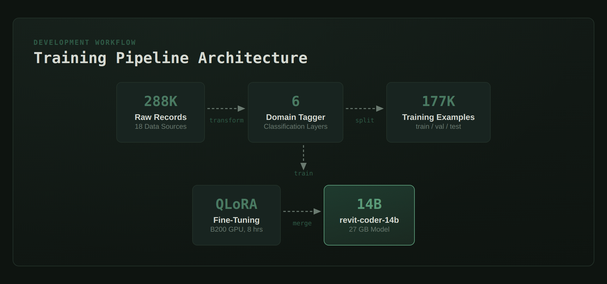
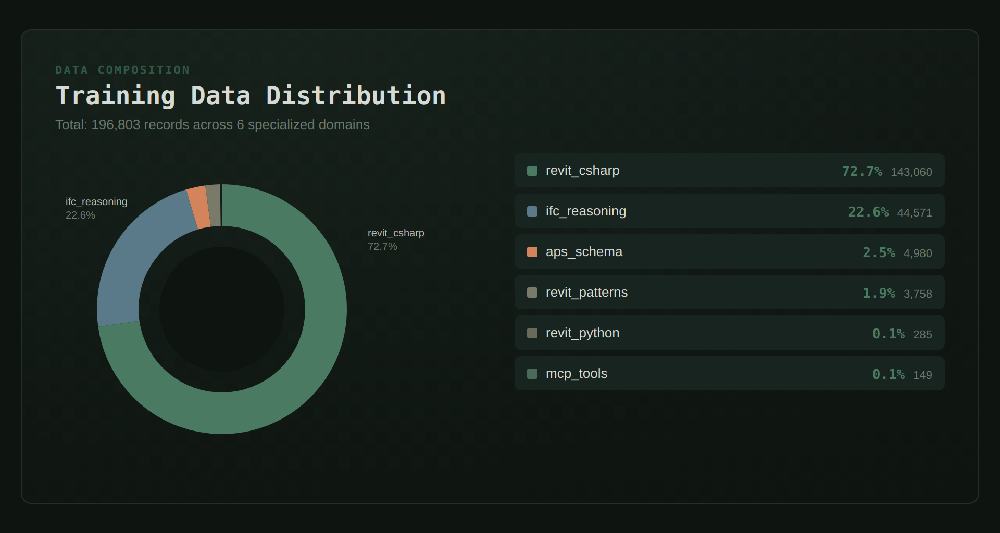

# revit-coder-14b




An experiment in domain-specific fine-tuning for Revit API code generation. Trained on 177K domain-tagged examples for $48 on a single B200 GPU. Achieved competitive performance with Claude Opus 4.6 (zero-shot) on a 40-question Revit C# benchmark (0.800 avg vs 0.793).

**Important context:** This is a zero-shot comparison. revit-coder-14b was fine-tuned on 177K Revit examples; Claude Opus 4.6 received no domain training. The 14B model excels on medium-difficulty tasks (won 14 of 19), while Claude leads on hard multi-class problems (tied 6-6 on hard questions).

## Results at a Glance

**Overall: 25 wins for revit-coder-14b, 15 wins for Claude Opus 4.6**

## Difficulty Breakdown

| Difficulty | Count | 14B Avg | Claude Avg | 14B Wins |
|------------|-------|---------|------------|----------|
| Easy | 9 | 0.800 | 0.796 | 5 |
| Medium | 19 | **0.839** | 0.801 | 14 |
| Hard | 12 | 0.736 | **0.779** | 6 |

**Strongest on medium complexity:** The 14B model won 14 of 19 medium-difficulty questions, covering typical Revit plugin work like parameter filters, family placement, view creation, and extensible storage.

**Where Claude edges ahead:** Hard questions requiring complex compositional patterns (TransactionGroups, DWG export options, chained logical filters). Claude's larger capacity helps on multi-class, multi-concept answers.



## Scoring Components



Three scoring axes:
- **Signal Presence (40%):** Does the response contain the right API keywords?
- **Code Quality (30%):** Does it have proper structure? (namespaces, class declarations, API patterns)
- **Completeness (30%):** Is it thorough? (response length, code blocks, error-free)

The 14B model excels at **signal presence** and **code quality**, knowing exact Revit API terms from training. Claude leads slightly on **completeness** with longer, more structured responses.

## Key Findings

1. **Domain fine-tuning achieves competitive performance.** A 14B model trained on 177K Revit examples matched Claude Opus 4.6's zero-shot performance on Revit-specific code generation tasks.

2. **Strongest on medium complexity.** The model's biggest gains were on practical, everyday Revit API patterns.

3. **Runs locally.** The model runs entirely offline on consumer hardware. No API keys, no usage limits, no data leaving the machine.

4. **Low training cost.** 8 hours on a single B200 GPU, ~$48 total. The model card has full details.

## Limitations & Methodology Notes

- **Zero-shot comparison:** The 14B model was fine-tuned on 177K Revit examples; Claude Opus 4.6 was not given any domain training. This is an asymmetric comparison.
- **Automated scoring:** No manual verification. Scores are based on keyword presence and code structure, not compilation or execution.
- **Completeness bias:** The scoring rewards longer responses, which may favor Claude's more verbose style.
- **Hard task performance:** Claude leads on complex multi-class implementations (IUpdater, TransactionGroups, shared parameters).
- **Full methodology:** See [benchmark/SHOWCASE.md](benchmark/SHOWCASE.md) for detailed scoring methodology and limitations.

## Run the Benchmark

```bash
# Requires: Ollama with revit-coder-14b-f16 model loaded
# Requires: pip install matplotlib numpy requests

# 1. Run fine-tuned model (40 questions, ~80 min)
python benchmark/run_ollama.py

# 2. Score Claude responses (see benchmark/SHOWCASE.md for details)
python benchmark/parse_claude_response.py

# 3. Score and generate charts
python benchmark/score.py --verbose
python benchmark/generate_charts.py
```

Full deep-dive: [benchmark/SHOWCASE.md](benchmark/SHOWCASE.md)

## Training



| Spec | Value |
|------|-------|
| Base Model | Qwen3-14B-Instruct |
| Method | QLoRA (rank 64, alpha 128, Unsloth) |
| Training Data | 159,414 examples (90% of 177K total) |
| Validation Data | 8,856 examples (5%) |
| Epochs | 3 |
| Effective Batch Size | 16 (4 × 4 gradient accumulation) |
| Learning Rate | 2e-4 with cosine schedule |
| Sequence Length | 4096 tokens |
| GPU | NVIDIA B200 192GB |
| Time | ~8 hours |
| Cost | ~$48 |

### Train/Val/Test Split

The 177,127 examples were split as follows:

| Split | Count | % | Purpose |
|-------|-------|---|---------|
| Train | 159,414 | 90% | Model training |
| Validation | 8,856 | 5% | Hyperparameter tuning & early stopping |
| Test | 8,857 | 5% | Final evaluation (not used in this benchmark) |

**Split strategy:** Stratified sampling by domain to maintain proportional representation of all 6 BIM domains across train/val/test sets. Random seed: 42.

**Note:** The 40-question benchmark is separate from the training data—it tests the model's zero-shot generalization on new Revit API questions not seen during training.

### Training Data Distribution



| Domain | Records | % | Description |
|--------|---------|---|-------------|
| revit_csharp | 143,060 | 72.7% | Revit API C# code generation |
| ifc_reasoning | 44,571 | 22.6% | IFC topology and BIM reasoning |
| aps_schema | 4,980 | 2.5% | APS/Forge cloud APIs |
| revit_patterns | 3,758 | 1.9% | Revit development patterns |
| revit_python | 285 | 0.1% | pyRevit automation |
| mcp_tools | 149 | 0.1% | MCP tool definitions |

## Model Weights

Available on HuggingFace: [schauh11/revit-coder-14b](https://huggingface.co/schauh11/revit-coder-14b)

## What This Is

A domain fine-tuned **Revit API code generator** trained on Revit C#, IFC, and BIM data:

- **Generate** correct Revit C# code (element collection, parameter access, transactions)
- **Validate** Revit API usage (catch missing Transactions, null checks, wrong filters)
- **Reason** about IFC spatial hierarchies and BIM data structures
- **Run locally** on consumer hardware, no API keys, no data leaving the machine

## Project Structure

```
revit-coder-14b/
├── benchmark/                     # Benchmark suite
│   ├── questions.json                 # 40 domain questions
│   ├── run_ollama.py                  # Ollama runner
│   ├── score.py                       # Automated scoring
│   ├── generate_charts.py             # Generate comparison charts
│   ├── capture_claude.py              # Claude response capture
│   ├── parse_claude_response.py       # Parse Claude output
│   ├── BENCHMARK_FULL.md              # Full benchmark with all responses
│   ├── SHOWCASE.md                    # Benchmark deep-dive
│   ├── charts/                        # Generated PNG charts
│   └── results/                       # Raw JSON scores and responses
├── training/                      # Training scripts
│   ├── train_qwen3_unsloth.py         # Unsloth QLoRA training
│   └── setup_runpod.sh                # GPU pod setup
├── scripts/                       # Utilities
│   ├── merge-lora.py                  # Merge LoRA into base model
│   └── create_expanded_splits.py      # Create train/val/test splits
├── prompts/                       # System prompts
│   └── revit-expert-system.md         # Domain system prompt
├── images/                        # Presentation graphics
├── docs/                          # Documentation
│   ├── convert-lora-to-gguf.md        # LoRA to GGUF conversion guide
│   └── bim-data-taxonomy.md           # BIM domain taxonomy
├── presentation/                  # Charts and graphics specs
│   ├── mermaid-charts.md              # Mermaid chart definitions
│   └── graphics-spec.md              # Graphics design spec
├── model_card.md                  # HuggingFace model card
├── LICENSE                        # Apache 2.0
└── README.md
```

## Documentation

- [Benchmark Deep Dive](benchmark/SHOWCASE.md) - All 5 charts, per-question analysis, failure modes
- [Benchmark Report](benchmark/results/report.md) - Score tables from latest run
- [Full Benchmark](benchmark/BENCHMARK_FULL.md) - All 40 questions with both models' responses
- [Model Card](model_card.md) - HuggingFace-format model card
- [LoRA to GGUF](docs/convert-lora-to-gguf.md) - Convert and quantize for Ollama

## License

Apache 2.0
